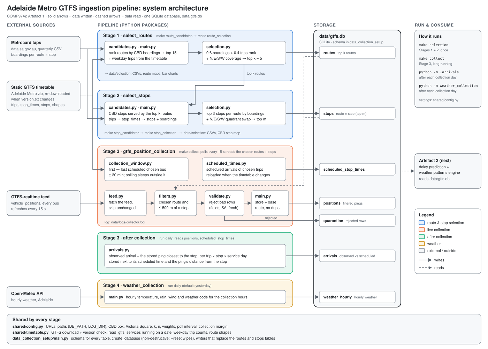

# Adelaide Metro Data Ingestion Pipeline

COMP9742 Artefact 1: the data ingestion module for a bus delay prediction and weather patterns engine.
It picks a small set of busy Adelaide Metro bus routes and CBD stops, then records where those buses are
as they approach those stops, next to their scheduled times and the weather.

## Architecture



```
Stage 1  routes     Metrocard taps + timetable → 15 route candidates → top k = 5 routes   (CSV + routes table)
Stage 2  stops      top k routes → their CBD stops → top 3 per route, N/E/S/W covered      (CSV + stops table)
Stage 3  positions  live feed every 15 s → validated pings of chosen routes near chosen stops (positions table)
         arrivals   closest ping per trip × stop × day vs its scheduled time               (arrivals table)
Stage 4  weather    Open-Meteo hourly weather for the collection hours                     (weather_hourly table)
```

## Requirements

- **Python 3.12 or newer** (`python3 --version`); the pinned numpy needs 3.12.
- **make**, to use the `make` commands (optional; every command also has a plain Python form).
  macOS: `xcode-select --install`. Linux: usually installed (`sudo apt install make` otherwise).
  Windows: use the Python commands.
- **Internet access**: the timetable, Metrocard taps, live feed and weather are downloaded.
- **About 200 MB of disk** for `data/` (timetable ≈ 80 MB, Metrocard taps ≈ 55 MB, plus the database).
- Optional: the `sqlite3` command-line tool to look inside `data/gtfs.db`.

## Install

```bash
make install
```

or, without make:

```bash
python3 -m venv venv
source venv/bin/activate              # Windows: venv\Scripts\activate
pip install -r requirements.txt
```

The Python commands below assume the virtual environment is active (`source venv/bin/activate`).
The `make` commands use `venv/bin/python` directly, so they need no activation.

## Run

Run everything from the repository root, in this order.

| Step | make | python |
|---|---|---|
| 1. Create the database (optional; later steps create it too) | `make setup` | `python -m data_collection_setup` |
| 2. Choose routes and stops (all four steps below) | `make selection` | the four commands below, in order |
| &nbsp;&nbsp;2a. Route candidates | `make route_candidates` | `python -m select_routes` |
| &nbsp;&nbsp;2b. Top k routes | `make route_selection` | `python -m select_routes.selection` |
| &nbsp;&nbsp;2c. Stop candidates | `make stop_candidates` | `python -m select_stops` |
| &nbsp;&nbsp;2d. Top m stops | `make stop_selection` | `python -m select_stops.selection` |
| 3. Collect live positions (leave running; Ctrl+C stops) | `make collect` | `python -m gtfs_position_collection` |
| 4. Observed vs scheduled arrivals (after each collection day) | `make arrivals` | `python -m gtfs_position_collection.arrivals` |
| Rebuild scheduled times (optional; the collector does it at start and each day) | `make schedule` | `python -m gtfs_position_collection.scheduled_times --force-reload` |
| 5. Hourly weather (after each collection day; default yesterday) | `make weather` or `make weather DAY=2026-10-07` | `python -m weather_collection` or `python -m weather_collection 2026-10-07` |
| Tests | `make test` | `python -m pytest tests` |

`make` on its own lists the commands. Each step reads the latest output of the step before it.

Useful extras:

- `python -m gtfs_position_collection --once`: one poll, ignoring the collection window, to check the collector.
- `python -m data_collection_setup --reset`: deletes `data/gtfs.db` and starts empty (wipes collected data).
- On a Mac, keep the machine awake while collecting: `caffeinate -i make collect`.
- Watch the collector: `tail -f data/logs/collector.log`.

## What each step does

| Step | What it does | Writes |
|---|---|---|
| Route candidates | Ranks bus routes by Metrocard boardings at CBD stops (latest quarter) and keeps the top 15; adds each route's weekday trips (busiest Wednesday of the next 4 weeks). | `data/selection/route_candidates_<ts>.csv`, route map, bar charts |
| Top k routes | Score = 0.6 × boardings rank + 0.4 × weekday-trips rank (lower is better); the best route heading N, E, S and W from Victoria Square is taken first, then the rest by score, up to k = 5. | `top_k_routes_<ts>.csv`, map, `routes` table |
| Stop candidates | Every CBD stop the top k routes serve (timetable: trips → stop_times → stops), with each stop's boardings on that route. | `stop_candidates_<ts>.csv` |
| Top m stops | Top 3 stops per route by boardings, tagged N/E/S/W from Victoria Square; the best stop of any missing quadrant replaces its route's lowest pick. | `top_m_stops_<ts>.csv`, CBD map, `stops` table |
| Collect | Every 15 s (the feed's refresh rate), from 30 min before the first to 30 min after the last scheduled chosen bus at the chosen stops: fetch, skip an unchanged snapshot, keep chosen routes within 500 m of a chosen stop, validate, store. Sleeps outside the window, so one run covers several days; checks the timetable version each new day. | `positions`, `quarantine`, `scheduled_stop_times`, `pipeline_state`, `data/logs/collector.log` |
| Arrivals | For each trip × chosen stop × service day, the stored ping closest to the stop is the observed arrival, next to its scheduled time (from `scheduled_stop_times`) and the ping's distance. Safe to re-run. | `arrivals` |
| Weather | Hourly temperature, precipitation, wind speed and weather code for one day; only the collection hours when positions exist for that day. | `weather_hourly` |

## Modules

### `shared/`
- `config.py`: every setting: URLs, data paths (`DB_PATH`, `LOG_DIR`), CBD box, Victoria Square, k / n, weights, poll interval, collection margin.
- `timetable.py`: downloads the static GTFS timetable when its `version.txt` changes, and reads it: `read_gtfs`, bus routes, CBD stops, services running on a date, weekday trip counts, each route's main shape.

### `data_collection_setup/`
- `main.py`: the database schema, `create_database` (never deletes data unless `--reset`), `connect_to_database` (the one way every stage opens the database: foreign keys on, rows by column name), and the writers that replace the `routes` and `stops` tables.

### `select_routes/` (Stage 1)
- `main.py`: route candidates driver (CSV, map, bar charts).
- `validations.py`: finds and downloads the newest quarterly Metrocard taps file from data.sa.gov.au.
- `candidates.py`: ranks routes by CBD boardings and keeps every variant's GTFS route id (e.g. `G10 G10A G10B`).
- `selection.py`: weighted rank + N/E/S/W coverage → top k routes; writes the CSV, map and `routes` table.
- `plots.py`: route maps on an Adelaide basemap and the boardings / weekday-trips bar charts.

### `select_stops/` (Stage 2)
- `main.py`: stop candidates driver.
- `candidates.py`: CBD stops served by the top k routes, with each stop's boardings on that route.
- `selection.py`: top n stops per route + quadrant swap → top m stops; writes the CSV, map and `stops` table.
- `plots.py`: CBD map of the chosen stops coloured by quadrant.

### `gtfs_position_collection/` (Stage 3)
- `main.py`: the collector loop: fetch → skip unchanged → filter → validate → store, one log line per poll; a failed poll is logged and undone, never fatal.
- `feed.py`: downloads the live `vehicle_positions` feed and turns each bus into a `positions` row.
- `collection_window.py`: first to last scheduled arrival of the chosen routes at the chosen stops for the services running that day (± 30 min), including GTFS times past midnight.
- `scheduled_times.py`: scheduled arrivals of the chosen trips at the chosen stops (`scheduled_stop_times`), built from the `routes` / `stops` tables. Checks `version.txt` at most once a day and rebuilds when the timetable or the selection changes; rows of earlier timetable versions are kept.
- `filters.py`: keeps a bus when its base route is chosen (`G10A` → `G10`) and it is within 500 m of a chosen stop.
- `validate.py`: rejection layer, in order: required fields; position inside South Australia; timestamp at most 90 s old and at most 10 s in the future; trip scheduled at a chosen stop. Rejected rows go to `quarantine` with the reason, details and raw row; a report the feed repeats is quarantined once.
- `arrivals.py`: closest ping per trip × stop × day as the observed arrival, next to its scheduled time from `scheduled_stop_times` (newest timetable version if a trip appears in several).

### `weather_collection/` (Stage 4)
- `main.py`: hourly weather from Open-Meteo for one day into `weather_hourly`.

### Other
- `tests/`: pytest tests.
- `fetch_gtfs.py`: standalone helper that dumps one GTFS feed (realtime or static) to CSV for inspection.

## Database: `data/gtfs.db`

| Table | One row per | Key | Written by |
|---|---|---|---|
| `routes` | chosen route: boardings, weekday trips, ranks, score, direction, GTFS variant ids | `route` | top k routes |
| `stops` | chosen route × stop: boardings, quadrant, rank, why chosen | `(route, stop_id)` → `routes` | top m stops |
| `scheduled_stop_times` | scheduled arrival of a chosen trip at a chosen stop, per timetable version | `(gtfs_version, trip_id, stop_sequence)` | collector, `make schedule` |
| `positions` | vehicle report of a chosen route near a chosen stop | `UNIQUE (vehicle_id, timestamp)`; `route` → `routes` | collector |
| `quarantine` | rejected feed row: reason, details, raw row | `quarantine_id` | collector |
| `arrivals` | trip × stop × service date: observed vs scheduled arrival, distance of the ping | `(trip_id, stop_id, service_date)` | arrivals |
| `pipeline_state` | key/value notes: timetable version checked and loaded, selection fingerprint | `key` | collector |
| `weather_hourly` | local hour: temperature, precipitation, wind speed, weather code | `hour_local` | weather |

`positions.trip_route_id` is the feed's raw route id (e.g. `G10A`); `positions.route` is its base code (`G10`).
Once positions exist, the selection is locked to protect them: to change routes or stops, run
`python -m data_collection_setup --reset`, then the selection and collection again.

## Data folder (`data/`, not in git)

```
data/timetable/     static GTFS timetable (re-downloaded when its version changes)
data/validations/   quarterly Metrocard taps CSV (cached)
data/selection/     timestamped candidates / selection CSVs and PNG charts
data/logs/          collector.log
data/gtfs.db        the SQLite database
```

## Configuration

Edit `shared/config.py`:

| Setting | Default | Meaning |
|---|---|---|
| `N_CANDIDATES`, `K_ROUTES` | 15, 5 | route candidates, routes kept |
| `WEIGHT_BOARDINGS`, `WEIGHT_TRIPS` | 0.6, 0.4 | route score weights |
| `N_STOPS_PER_ROUTE` | 3 | stops kept per route |
| `LIVE_POLL_SECONDS` | 15 | time between polls (the feed refreshes every 15 s) |
| `COLLECTION_MARGIN_MINUTES` | 30 | extra time before the first and after the last scheduled bus |
| `POSITION_MAX_AGE_SECONDS`, `POSITION_FUTURE_TOLERANCE_SECONDS` | 90, 10 | oldest / most-future vehicle timestamp accepted by validation |
| `SA_LAT_MIN` … `SA_LON_MAX` | South Australia box | positions outside it are quarantined |

The 500 m stop radius is `STOP_RADIUS_M` in `gtfs_position_collection/filters.py`.

## Known limitations

- Metrocard taps are a quarter behind, grouped into ranges (the range floor is summed, a lower bound), and count tap-ons only.
- A timetable-change criterion for route selection was dropped: the free Transitland key cannot download historical feeds.
- Most chosen stops lie north of Victoria Square (10 N, 1 E, 1 S, 1 W), because the chosen routes run mainly along Currie, Grenfell and King William Streets.
- An observed arrival is the closest stored ping within 500 m, not the moment the bus reached the stop; at a 15 s poll it can be off by up to a minute. `arrivals.distance_m` records how close that ping was.
- Delay is not defined yet (Artefact 2); scheduled and observed times are stored side by side.
